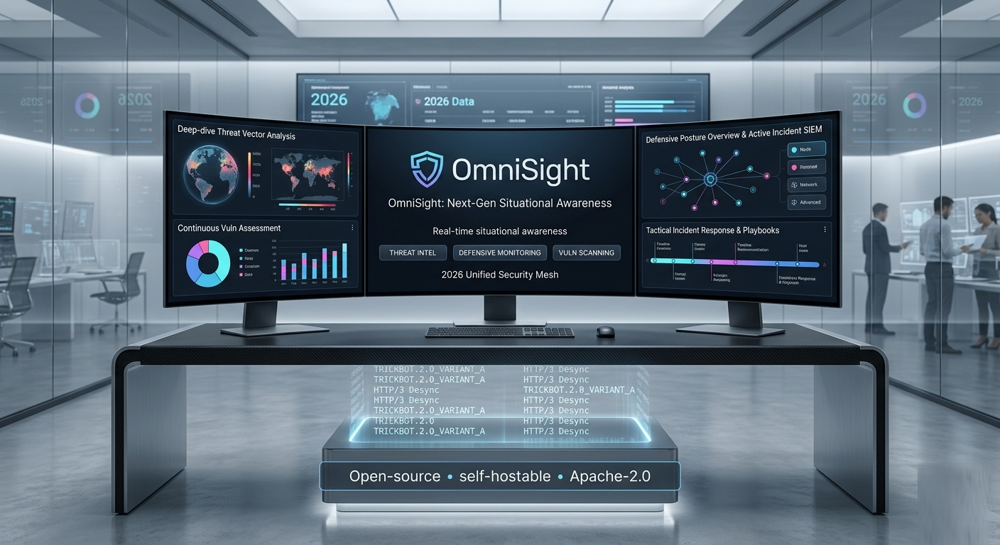

<p align="center">
  
</p>

<p align="center">
  <b>Open-source, real-time cyber situational-awareness platform.</b><br>
  Fuse vulnerability, exploitation, indicator, and threat-actor signals into one correlated, glanceable dashboard —
  match them against <i>your</i> environment, and actively scan it — self-hostable in minutes.
</p>

<p align="center">
  <a href="#license"></a>
  
  
  
  
</p>

---

OmniSight is the lightweight, opinionated alternative to heavyweight platforms like OpenCTI/MISP for teams who want to
**see what's on fire right now**, then drill in — without the deployment tax. It runs with **zero API keys** on public
feeds (optional keys unlock premium sources), starts with a single `docker compose up`, and is permissively licensed
(Apache-2.0) for maximum adoption and contribution.

> Think *"WorldMonitor for cyber"*: fast, glanceable, correlation-first — and now extended from a threat-intel feed
> into a full **detect → match → scan** loop across all three roadmap phases.

## Table of contents

- [Live demo](#live-demo)
- [Why OmniSight](#why-omnisight)
- [Feature tour](#feature-tour)
  - [Phase 1 — Threat-intel dashboard](#phase-1--threat-intel-dashboard)
  - [Phase 2 — Defensive monitoring](#phase-2--defensive-monitoring)
  - [Phase 3 — Vulnerability scanning](#phase-3--vulnerability-scanning)
- [Quick start](#quick-start)
- [Architecture](#architecture)
- [Configuration](#configuration)
- [Data sources](#data-sources)
- [Adding feeds at runtime](#adding-feeds-at-runtime)
- [API overview](#api-overview)
- [Exports & interop](#exports--interop)
- [Authentication & roles](#authentication--roles)
- [Deployment](#deployment)
- [Roadmap](#roadmap)
- [Contributing](#contributing)
- [Security & responsible use](#security--responsible-use)
- [License](#license)

## Live demo

A static, **read-only** demo runs on GitHub Pages — no backend, no database, no
keys — so you can click through the dashboard (Overview, Vulnerabilities,
Indicators, Assets, Monitoring, Scanning, Actors, Map, News) with curated sample
data:

**https://nerttiyana-technologies.github.io/OmniSight/**

> The demo serves bundled fixtures instead of the live API (writes are no-ops and
> there are no real-time updates). For the full experience — live ingestion,
> enrichment, scanning, and alerts — run it locally or self-host (below).

## Why OmniSight

The open-source threat-intel space splits into two camps with a gap in the middle: **heavy enterprise platforms**
(OpenCTI, MISP, TheHive) that are powerful but steep to deploy and run, and **lightweight feed tools** that are easy but
narrow. OmniSight targets the gap — a modern, permissively-licensed, TypeScript platform that does WorldMonitor's
situational-awareness job for cyber:

- **Correlation-first, not just aggregation.** The differentiator is meaningful cross-stream correlation and a composite
  "what to worry about now" risk score — CVE ↔ KEV ↔ EPSS ↔ CVSS ↔ ATT&CK ↔ IOCs ↔ scan findings — not yet another feed reader.
- **Glanceable executive UX.** A real-time dashboard with an executive-grade theme, full dark/light support, and
  icon-based action buttons with tooltips throughout.
- **Trivial to run.** PostgreSQL + Redis only; no ElasticSearch/RabbitMQ/MinIO. A zero-dependency in-memory demo mode
  needs no database at all.
- **Yours to extend.** A tiny connector SDK and a pluggable scan-adapter contract; new RSS/JSON/TAXII feeds can be added
  from the dashboard at runtime — no code, no redeploy.

## Feature tour

### Phase 1 — Threat-intel dashboard

**Ingestion & normalization.** A pluggable connector model — each connector is a small TypeScript module on a cron.
Built-in connectors cover **CISA KEV** (known-exploited), **NVD** (recent CVEs), **abuse.ch ThreatFox**, **AlienVault OTX**,
and **Pulsedive** (free REST Explore API) for indicators; **MITRE ATLAS** (STIX 2.1) and RSS for news/advisories. Everything
normalizes to one shared domain model (vulnerabilities, indicators, advisories, actors, sources).

**Enrichment.** **EPSS** exploit-probability (keyless, bulk, every 30 min and on-demand), **NVD CVSS** (rate-limited, raised
10× with `NVD_API_KEY`), and **IP geolocation** (keyless ipwho.is) feed a composite **risk score** (active exploitation
dominates, then ransomware association, then CVSS/EPSS).

**Dashboard.** An **Overview** command center leads with a DEFCON-style threat-level header derived from current signal
volume, plus the **Daily Brief** (top risks, new KEV, what's hitting your stack, top indicators) rendered as Markdown and
as an executive **HTML email** the worker composes each morning. **Vulnerabilities** and **Indicators** tabs each have a
server-side filter/sort/paginate grid; a **News** tab renders advisory cards; a **Map** tab plots geolocated attack
origins; an **Actors** tab aggregates indicators into malware-family/campaign profiles.

**Correlation.** The same CVE from multiple sources is keyed on `(source, id)` and merged in an **Entity-resolution** view
with per-source reliability. **CVE ↔ IOC correlation** links CVE references found in indicator context to tracked
vulnerabilities; an optional **AI correlation** view (any OpenAI-compatible endpoint, including local Ollama) proposes
relationships with confidence + rationale. ATT&CK/ATLAS techniques referenced across intel are ranked and shown in a
**tactic × technique coverage matrix**, with **detection-gap analysis** flagging techniques no enabled rule covers.

**Analyst workflow.** One-click **IOC enrichment & pivoting** (Shodan InternetDB + GreyNoise/AbuseIPDB/Pulsedive when
keyed), an **IOC extractor** (paste text → refanged, grouped observables), **investigation notes** with TLP marking,
**confirmed / false-positive feedback**, **saved searches**, an **RFI tracker**, **SBOM scanning** (CycloneDX/SPDX → OSV),
**source-reliability weighting**, and **IOC aging/decay**.

**Alerting & automation (SOAR-lite).** Watchlist alerts to webhook/email; user-defined **automation rules**
(trigger: min-risk / exploited-only / stack-only → action: webhook / email / Jira); per-stack-vuln **Jira** ticketing.

**Real-time.** The dashboard subscribes to Server-Sent Events; in Postgres mode the worker signals the API via
`LISTEN/NOTIFY` so a separate worker process still pushes live updates, with a 15s polling fallback.

### Phase 2 — Defensive monitoring

Match the global feed against **your** environment.

- **Structured asset inventory** (`Assets` tab) — vendor, product, version, **CPE**, IP/hostname, owner, criticality,
  tags. Populate it by manual entry, **CSV import**, **SBOM import** (CycloneDX/SPDX components become tracked assets), or
  **scan discovery** (Phase 3 registers what it finds).
- **Intelligent CVE → asset matching** — incoming CVEs are matched to assets by **CPE** (strongest), then vendor+product,
  then term, risk-ranked with the matching reason shown ("Vulnerabilities affecting your assets").
- **My Stack, evolved.** "My Stack" is now the lightweight view over the inventory: asset-derived terms are unioned with
  the watchlist to drive stack matching, alert rules, the `inStack` stat, and the daily brief.
- **Environment-event monitoring** (`Monitoring` tab) — observables seen in your own logs/sensors are matched against
  tracked indicators via three paths: a **JSON push API** (`POST /api/events`), **file/NDJSON/text upload**, and an
  opt-in **syslog listener** (UDP + TCP) in the worker. Matched events carry severity, source, and malware context.

### Phase 3 — Vulnerability scanning

Actively assess hosts/URLs you own and feed the results back into correlation (`Scanning` tab).

- **Keyless built-in scanner** — a TCP port sweep with service identification, HTTP banner/version-disclosure detection,
  and missing-security-header checks. No external tools required; works in the zero-dependency demo.
- **Pluggable adapter contract** — external engines implement one interface. An optional **nuclei** adapter runs only
  when `SCANNER_NUCLEI=true` and the binary is on `PATH`, with its CVE classifications flowing into findings.
- **Correlation + asset discovery** — discovered products are matched to tracked CVEs (extra findings carry the CVE and
  its risk), and the scanned host is registered as an asset — closing the loop back into Phase 2.
- **Ad-hoc or scheduled** — run on demand from the dashboard, or save a target with a cron for the worker to scan on
  schedule. *Only scan systems you are authorized to test.*

## Quick start

### Zero-dependency demo (no database)

```bash
pnpm install
pnpm start:api                      # seeds demo data from the CISA KEV fixture (in-memory)
pnpm --filter @omnisight/web dev    # dashboard at http://localhost:5173
```

### Full stack (Postgres + Redis + live ingestion)

```bash
cp .env.example .env
docker compose up -d                # Postgres + Redis
pnpm install
pnpm start:api                      # API on :4000
pnpm start:worker                   # ingests feeds on cron, runs scheduled scans + syslog
pnpm --filter @omnisight/web dev    # dashboard
```

### Verify the ingest pipeline offline

```bash
pnpm connector:dry-run --fixture    # offline, bundled sample
pnpm connector:dry-run              # live fetch from CISA
```

> **Requirements:** Node ≥ 20 and pnpm. After pulling new code, run `pnpm install` so workspace packages
> (including `@omnisight/scanner`) are linked.

## Architecture

A pnpm + Turborepo monorepo — one language end to end, from feed to pixel.

```
apps/web        React + Vite dashboard (executive dark/light theme, icon buttons + tooltips, SSE live updates)
apps/api        Fastify REST API (+ admin "add feed", assets, events, scans endpoints)
apps/worker     BullMQ worker: connectors on cron + enrichment + scheduled scans + syslog listener
packages/shared       Domain model + zod schemas + risk scoring + exporters (the shared language)
packages/connectors   Connector SDK + built-in connectors + generic config-driven RSS/JSON/TAXII connectors
packages/scanner      Pluggable scan adapters: keyless built-in scanner + optional nuclei + scan runner
packages/db           Repository: PostgreSQL (prod) with an in-memory fallback (demo); one Repository interface
```

```
                 ┌──────────────────────────────────────────────┐
   feeds ───────►│ connectors ─► normalized (zod) ─► repository  │◄── assets / events / scans
 (HTTP/RSS/JSON/ │                                      │        │
   TAXII)        └──────────────────────────────────────┼────────┘
                                                         ▼
   scan targets ─► packages/scanner ─► findings ─► PostgreSQL ──read──► Fastify API ──SSE──► React dashboard
                                                         ▲
                                              Redis + BullMQ worker (cron, enrichment, scans, syslog)
```

**Key choices:** PostgreSQL is the single system of record (full-text search + `JSONB` cover current needs — no
ElasticSearch); Redis backs the BullMQ queue and short-lived caches; a shared TypeScript types package gives end-to-end
type safety; the API is contract-first (Fastify + zod). The same `Repository` interface has a Postgres implementation and
an in-memory one, so the API and worker code is identical in demo and production.

## Configuration

All configuration is via environment variables (see [`.env.example`](.env.example)). Everything is optional except where
noted — the platform runs open, keyless, and in-memory out of the box.

| Variable | Purpose |
|----------|---------|
| `DATABASE_URL` | PostgreSQL connection. **Unset → in-memory demo store** seeded from the CISA KEV fixture. |
| `REDIS_URL` | Queue + cache. Required by the worker; optional for the API. |
| `API_PORT` | API port (default `4000`). |
| `AUTH_ENABLED`, `JWT_SECRET`, `JWT_EXPIRY_HOURS` | Opt-in auth. Off by default (open). |
| `ADMIN_USER`, `ADMIN_PASS` | Seed an initial admin on first boot when auth is on. |
| `OIDC_*`, `APP_URL` | Generic OIDC SSO (authorization-code flow); first-time users auto-provisioned as viewers. |
| `LLM_BASE_URL`, `LLM_API_KEY`, `LLM_MODEL` | Optional AI layer — any OpenAI-compatible endpoint or local Ollama. |
| `NVD_API_KEY` | Raises NVD rate limit 5→50 req/30s. |
| `ABUSECH_AUTH_KEY`, `OTX_API_KEY`, `PULSEDIVE_API_KEY` | Free keys that unlock the respective indicator connectors. |
| `GREYNOISE_API_KEY`, `ABUSEIPDB_API_KEY` | Optional IOC-enrichment providers (Shodan InternetDB is keyless). |
| `TAXII_TOKEN` / `TAXII_USER` / `TAXII_PASS` | Global fallback auth for TAXII feeds (per-feed auth lives in source config). |
| `HIBP_DOMAINS`, `HIBP_API_KEY` | Breach-exposure monitoring via Have I Been Pwned (free public collection; key optional). |
| `SMTP_*`, `DIGEST_TO`, `DIGEST_ON_START` | Daily-brief email delivery. |
| `ALERT_WEBHOOK`, `ALERT_TO`, `ALERT_MIN_RISK` | Default stack-alert routing (used when no automation rules exist). |
| `JIRA_*` | SOAR-lite: open a Jira issue per stack-affecting vuln. |
| `DECAY_PRUNE_DAYS` | Prune indicators not seen in N days (default 180). |
| `SYSLOG_ENABLED`, `SYSLOG_PORT` | **Phase 2** — opt-in syslog listener for environment-event IOC matching. |
| `EVENTS_PRUNE_DAYS` | **Phase 2** — environment-event retention (default 30). |
| `SCANNER_NUCLEI` | **Phase 3** — also use nuclei when the binary is present (built-in scanner is always on). |

## Data sources

OmniSight ships seeded with high-signal, mostly-keyless feeds and lets you add the long tail at runtime.

| Type | Built-in / seeded | Access |
|------|-------------------|--------|
| Vulnerabilities | CISA KEV, NVD recent CVEs | keyless (NVD key optional) |
| Indicators | abuse.ch ThreatFox, AlienVault OTX, Pulsedive | free key each |
| Enrichment | EPSS, NVD CVSS, ipwho.is geo, OSV (SBOM) | keyless |
| Knowledge | MITRE ATT&CK / ATLAS | keyless |
| News / advisories | The Hacker News, Dark Reading, SecurityWeek-AI, **Ars Technica Security**, **BleepingComputer** | keyless RSS |
| Breach exposure | Have I Been Pwned (free public breaches collection) | keyless (key optional) |

Respect each source's license and rate limits. abuse.ch is free for non-commercial/community use; some vendor feeds carry
attribution requirements.

## Adding feeds at runtime

Admins can register a feed from the dashboard's **Add feed** panel (or `POST /api/sources`) — no code, no redeploy:

- **RSS / Atom (news & advisories)** — paste any feed URL (e.g. `https://feeds.arstechnica.com/arstechnica/security`).
  Articles appear in the **News** tab.
- **Generic JSON (vulnerabilities)** — point at any JSON feed, set the array path, and OmniSight maps fields into its model.
- **TAXII 2.1 (indicators)** — poll a collection's objects endpoint on a schedule (Bearer or Basic auth per feed).

```bash
curl -X POST localhost:4000/api/sources -H 'content-type: application/json' -d '{
  "name": "Ars Technica — Security", "kind": "rss", "signalType": "advisory",
  "url": "https://feeds.arstechnica.com/arstechnica/security"
}'
```

## API overview

A selection of the REST surface (all under `/api`):

| Area | Endpoints |
|------|-----------|
| Signals | `GET /vulnerabilities`, `GET /indicators`, `GET /advisories`, `GET /stats`, `GET /stream` (SSE) |
| Correlation | `GET /correlations`, `GET /entities`, `GET /attack`, `GET /attack/matrix`, `GET /actors` |
| Assets (P2) | `GET/POST /assets`, `PATCH/DELETE /assets/:id`, `POST /assets/import/csv`, `POST /assets/import/sbom`, `GET /asset-matches` |
| Events (P2) | `POST /events` (JSON / NDJSON / text), `GET /events`, `GET /events/stats` |
| Scanning (P3) | `GET /scan/config`, `GET/POST /scan/targets`, `POST /scan/run`, `GET /scans`, `GET /scans/:id`, `GET /findings` |
| Workflow | `/notes`, `/feedback`, `/searches`, `/rfis`, `/rules`, `/detection-rules`, `/watchlist` |
| Interop | `/sbom`, `/import/stix`, `/enrich/ioc`, `/digest`, `*/export` |
| AI (optional) | `/ai/summarize`, `/ai/query`, `/ai/correlate` |
| Auth | `/auth/login`, `/auth/me`, `/auth/sso/*`, `/users`, `/audit` |

## Exports & interop

Both grids export the current filtered view. Vulnerabilities → **CSV**. Indicators → **CSV**, **STIX 2.1** bundle
(importable into OpenCTI/MISP), a plain **blocklist** (IPs/domains/URLs/hashes) for firewalls/IDS, **Sigma**, **YARA**, and
**Snort/Suricata** rules. The asset inventory exports to **CSV**. OmniSight pushes intel into the rest of your stack
rather than trapping it.

## Authentication & roles

Off by default (open). Set `AUTH_ENABLED=true` + `JWT_SECRET` and seed an admin to require login. Three roles — **viewer**
(read-only), **analyst** (notes, watchlist, enrich, import, assets, events, scans), **admin** (+ manage sources, users,
rules). Local username/password (scrypt-hashed) with JWTs; RBAC enforced server-side and reflected in the UI. **SSO** via a
generic OIDC authorization-code flow auto-provisions first-time users as viewers. An admin-only **audit log** records
mutating actions and logins.

## Deployment

`docker compose up` brings up Postgres + Redis; run the API, worker, and web app with the commands above. The platform
runs with zero API keys on public feeds; optional keys unlock premium sources. For production, set `DATABASE_URL` /
`REDIS_URL`, enable auth (`AUTH_ENABLED`, `JWT_SECRET`, admin seed), and configure SMTP for the daily brief. The scaling
path (only if needed) is partitioning high-volume tables, adding OpenSearch as a read replica for search, and API read
replicas — none required to start.

### Static demo on GitHub Pages (free)

The dashboard can be published as a **static, read-only** site with no backend —
ideal for a free public demo. When built with `VITE_DEMO=true`, the API client
serves bundled sample data instead of calling `/api/*` (see
[`apps/web/src/demo.ts`](apps/web/src/demo.ts)).

Automated deploy (recommended): the [`Deploy demo to GitHub Pages`](.github/workflows/deploy-pages.yml)
workflow builds and publishes on every push to `main`. Enable it once under
**Settings → Pages → Build and deployment → Source: GitHub Actions**. It derives
the project base path from the repo name automatically, so forks work unchanged.

Build it yourself (any static host):

```bash
# Outputs apps/web/dist — upload anywhere (Pages, Netlify, S3, nginx…)
pnpm build:demo                       # root path "/"
VITE_BASE=/OmniSight/ pnpm build:demo # under a GitHub Pages project path
pnpm --filter @omnisight/web preview  # preview the built demo locally
```

This is **GitHub-Pages-free** (static hosting on public repos costs nothing). A
true live demo needs the Node API/worker + Postgres, which GitHub doesn't host —
use a small PaaS (Render, Railway, Fly.io) or a VPS for that, with the frontend
pointed at your API.

## Roadmap

| Phase | Scope | Status |
|-------|-------|--------|
| **1** | Threat-intel dashboard — aggregate, correlate, score, alert | ✅ shipped |
| **2** | Defensive monitoring — asset inventory + CVE matching, environment-event/IOC matching | ✅ shipped |
| **3** | Vulnerability scanning — built-in + pluggable engines, findings correlated to CVEs/assets | ✅ shipped |
| Ongoing | Connector SDK + docs, STIX/TAXII interop, demo instance, good-first-issues | ↻ continuous |

## Contributing

Contributions are welcome — new connectors, scan adapters, and dashboard improvements especially. The connector SDK
(`packages/connectors`) and scan-adapter contract (`packages/scanner`) are intentionally small. Please run
`pnpm typecheck` before opening a PR and keep new data sources documented with their access terms.

## Security & responsible use

The vulnerability scanner performs active network probing. **Only scan hosts and applications you own or are explicitly
authorized to test.** OmniSight is provided under Apache-2.0 **without warranty**; you are responsible for complying with
the terms of every data source you connect and with applicable law. To report a security issue, please open a private
advisory rather than a public issue.

## License

**Apache-2.0** — see [LICENSE](LICENSE).
